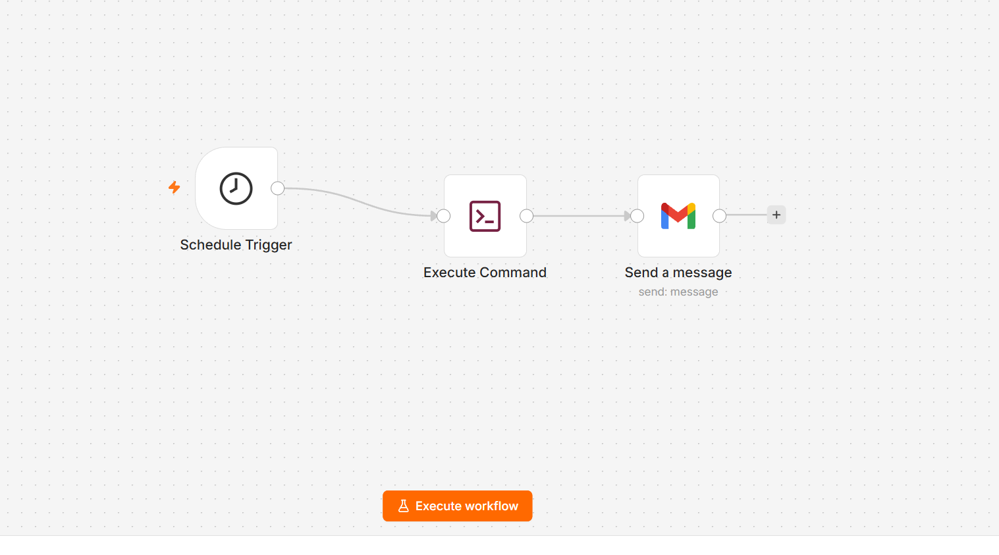
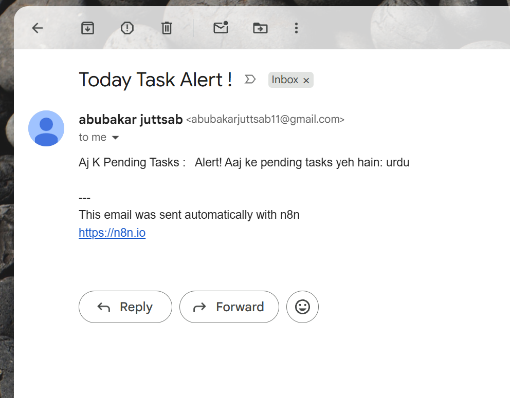

# Homework Reminder Automation (n8n + Python)

This repository contains a hybrid automation workflow that combines the scheduling and email capabilities of **n8n** with the local data-processing power of **Python**. 

The system runs daily to check a local database for pending homework tasks and sends an automated email alert if any tasks are incomplete.

## 🚀 Key Features
* **Scheduled Execution:** The workflow is triggered automatically every day at 7:00 AM using the `Schedule Trigger` node.
* **Local Script Integration:** Uses the n8n `Execute Command` node to run a Python script (`check_pending.py`) inside a Docker environment.
* **Automated Email Notifications:** Uses the `Gmail` node to send the generated alert directly to the user's inbox.

## 📂 Repository Structure
* `homework_reminder_workflow.json` - The main n8n workflow code.
* `scripts/` - A folder containing the Python scripts used for database creation, parsing, and updating tasks. (See the README inside the folder for CLI usage).

## 📸 Project Screenshots

### Workflow Architecture

### Live Email Alert

## 🛠️ Setup Instructions
1. Download the `homework_reminder_workflow.json` file and import it into your n8n instance.
2. Place the contents of the `scripts/` folder into a directory accessible by your n8n Docker container.
3. Authenticate the Gmail node with your own Google App Passwords/Credentials.
4. Activate the workflow.
